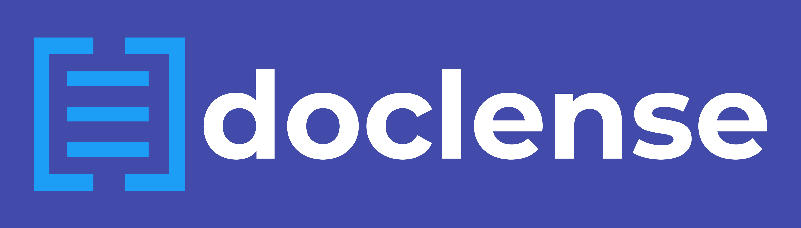

<!-- PROJECT LOGO -->

 

  

  

    An app for extracting text from camera-captured photos into .docx files
  

<!-- TABLE OF CONTENTS -->

## Table of Contents

* [About the Project](#about-the-project)
  * [Built With](#built-with)
* [Getting Started](#getting-started)
  * [Prerequisites](#prerequisites)
  * [Installation](#installation)
* [Usage](#usage)
* [Roadmap](#roadmap)
* [Contributors](#contributors)
* [Acknowledgements](#acknowledgements)

<!-- ABOUT THE PROJECT -->

## About The Project

![App Showcase][product-screenshot]

### Built With

* [Flask](http://flask.palletsprojects.com/en/1.1.x/)

<!-- GETTING STARTED -->

## Getting Started

### Prerequisites

* Setup Python using this [link](https://realpython.com/installing-python/)

### Installation

1. Create a virtual environment
	`cd <project-directory>`
	- On Unix-based OS's:
	`$ python3 -m venv venv`
	- On Windows:
	`$ py -3 -m venv venv`

2. Activate the environment
	- On Unix-based OS's:
	`$ . venv/bin/activate`
	- On Windows:
	`> venv\Scripts\activate`

3. Install Flask
	`$ pip install Flask`

<!-- USAGE EXAMPLES -->

## Usage

Simply click on the 'Upload' button and select a photo that contains printed text. Click on the 'Submit' button and wait briefly for you .docs file to start downloading.

<!-- ROADMAP -->

## Roadmap

### List of Proposed Features

* Improving recognition accuracy
* Integrating hand-written characters recognition
* Developing a mobile version of the app
* Create audio files using the text extracted. This might be handy for visually impaired people.

<!-- CONTRIBUTORS -->

## Contributors

- [Nader AbdAlGhani](https://github.com/naderabdalghani)
- [Mohamad Ahmad](https://github.com/MouhamedAhmed)
- [Mostafa Walid](https://github.com/sha3er97)
- [Omar Salah](https://github.com/arminArlert997)

<!-- ACKNOWLEDGEMENTS -->

## Acknowledgements

* [Dribbble](https://dribbble.com/shots/5489323-doclense-photo-scanner-logo-design)
* [One Page Love](https://onepagelove.com/leno)

<!-- MARKDOWN LINKS & IMAGES -->

[product-screenshot]: static/images/app-showcase.png
